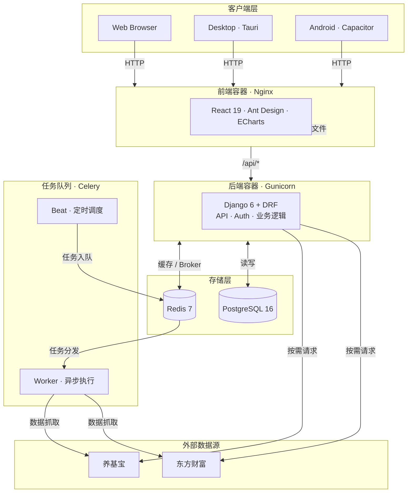

# Fundval


**盘中基金实时估值与逻辑审计系统**

拒绝黑箱，拒绝情绪化叙事。基于透明的持仓穿透 + 实时行情加权计算 + 硬核数学模型，让基金估值回归数学事实。


试用网址：https://fund.jasxu.dpdns.org/

**警告**：试用环境请勿使用真实持仓数据和 API Key

服务器内存和 CPU 性能较低，仅做使用演示

---

## 加入讨论群组

[issue - 讨论群组](https://github.com/Ye-Yu-Mo/FundVal-Live/issues/41)

## 快速开始

整个项目分为服务端 客户端两部分

服务端可以使用 Docker 或手动部署

### 最快方式（Docker）

```bash
curl -O https://raw.githubusercontent.com/Ye-Yu-Mo/FundVal-Live/main/docker-compose.yml
docker-compose up
```

访问 http://localhost:21345

**首次启动**：系统会自动同步基金数据，需要等待几分钟。

如果需要修改前端端口号，请修改 `docker-compose.yml`

```yaml
  frontend:
    image: jasamine/fundval-frontend:latest
    ports:
      - "21345:80"
    depends_on:
      - backend
    networks:
      - fundval
```

### 手动部署

#### 必需组件
- **Python**: 3.13+
- **Node.js**: 20+
- **npm**: 9+
- **uv**: Python 包管理器
- **数据库**: SQLite 3.x 或 PostgreSQL 16+

#### 可选组件
- **Redis**: 用于 Celery 任务队列（可选）
- **Nginx**: 生产环境反向代理（推荐）

#### 开始部署

```bash
git clone https://github.com/Ye-Yu-Mo/FundVal-Live.git
cd FundVal-Live
```

运行构建脚本

```bash
chmod +x build.sh
./build.sh
```

依次选择 构建前端，端口号设定，数据库初始化，静态文件收集

```bash
chmod +x start.sh stop.sh
./start.sh
```

### 管理员设置（必读）

启动之后，需要在日志中获取 Bootstrap Key

- Docker 用户：`docker-compose logs backend | grep 'BOOTSTRAP KEY'`
- 手动部署用户：运行 `./start.sh` 即可看到

然后访问 `http://localhost:21345/initialize`（需要换成你自己的 IP + 端口）进行初始化

填入 BOOTSTRAP KEY，配置管理员账户和密码，是否开通注册功能

如果开启注册功能，需要**重新启动后端**

## 功能特性

- **实时估值**：基于持仓穿透 + 实时行情加权计算，支持东方财富、养基宝双数据源
- **AI 分析**：接入任意 OpenAI 协议大模型，自定义提示词模板，支持基金和持仓两个维度分析
- **养基宝集成**：扫码登录、一键导入持仓、实时估值同步
- **持仓管理**：多账户、父子账户结构，支持买入/卖出流水，自动重算持仓
- **历史净值**：净值走势图，支持 1W / 1M / 3M / 6M / 1Y / ALL 时间范围
- **估值准确率**：记录每日估值误差，统计各数据源准确率
- **自选列表**：自定义基金自选分组
- **数据源偏好**：用户级别数据源切换，偏好持久化

## 技术栈

- **Frontend**: React 19 + Vite + Ant Design + ECharts
- **Backend**: Django 6 + DRF + Celery
- **Database**: PostgreSQL 16
- **Cache**: Redis 7
- **Platform**: Web + Desktop (Tauri) + Android (Capacitor)

### 客户端

可以通过Web页面直接访问使用，无需客户端

其他版本客户端，需前往 [Releases](https://github.com/Ye-Yu-Mo/FundVal-Live/releases/latest) 下载最新版本：

目前支持

* 安卓客户端
* macOS (ARM64)
* macOS (x86_64)
* Windows
* Linux

## 架构



前端通过 Nginx 反向代理 `/api/` 到后端。Celery Beat 定时触发净值同步，Worker 并发抓取多数据源后写入 PostgreSQL。

### 容器启动流程

Docker 容器启动时，`backend/entrypoint.sh` 会自动执行：

1. 等待数据库就绪
2. 运行数据库迁移 (`migrate`)
3. 收集静态文件 (`collectstatic`)
4. 检查系统初始化状态 (`check_bootstrap`)
5. **自动同步基金数据**（仅在数据库为空时，`sync_funds --if-empty`）
6. 启动应用

如需手动同步基金数据：

```bash
# Docker 环境
docker-compose exec backend python manage.py sync_funds

# 手动部署
cd backend && uv run python manage.py sync_funds
```

## 项目结构

```
fundval/
├── frontend/          # React 前端
├── backend/           # Django 后端
│   ├── api/
│   │   ├── sources/   # 数据源（东方财富、养基宝）
│   │   └── services/  # 业务逻辑（持仓计算、养基宝导入）
│   └── entrypoint.sh  # Docker 启动脚本（自动迁移）
├── docker-compose.yml # Docker 编排
├── start.sh           # 手动部署启动脚本（自动迁移）
└── .github/workflows/ # CI/CD
```


---

## 开源协议

本项目采用 **GNU Affero General Public License v3.0 (AGPL-3.0)** 开源协议。

**这意味着**：
- 你可以自由使用、修改、分发本软件
- 个人使用无需开源你的修改
- 如果你用本项目代码提供网络服务（SaaS），必须开源你的修改
- 衍生作品必须使用相同协议

**为什么选择 AGPL-3.0？**
- 金融工具需要透明度，用户有权知道估值逻辑
- 防止闭源商业化，确保改进回流社区
- 保护开源生态，避免"拿来主义"

详见 [LICENSE](LICENSE) 文件。

---

## 免责声明

本项目提供的数据与分析仅供技术研究使用，不构成任何投资建议。市场有风险，代码无绝对，交易需谨慎。

---

## Star History

[](https://www.star-history.com/#Ye-Yu-Mo/FundVal-Live&type=date&legend=top-left)
